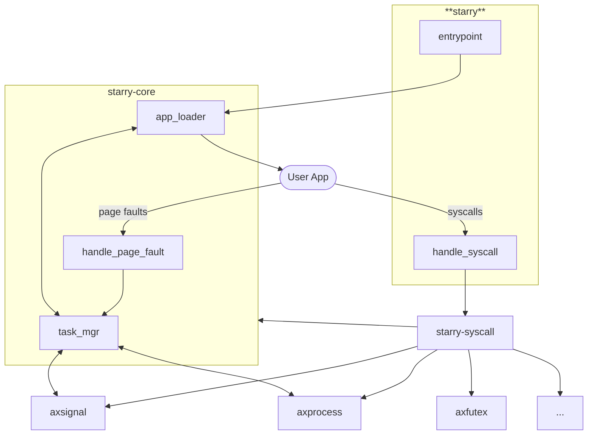

# 宏内核架构设计

```mermaid
flowchart TD
    subgraph **starry**
    entrypoint
    handle_syscall
    end
    subgraph starry-core
    app_loader <--> task_mgr
    handle_page_fault --> task_mgr
    end
    entrypoint --> app_loader --> app([User App])
    app -- syscalls --> handle_syscall --> starry-syscall --> starry-core
    app -- page faults --> handle_page_fault
    task_mgr <--> axsignal
    task_mgr <--> axprocess
    starry-syscall --> axsignal
    starry-syscall --> axprocess
    starry-syscall --> axfutex
    starry-syscall --> ...
```
